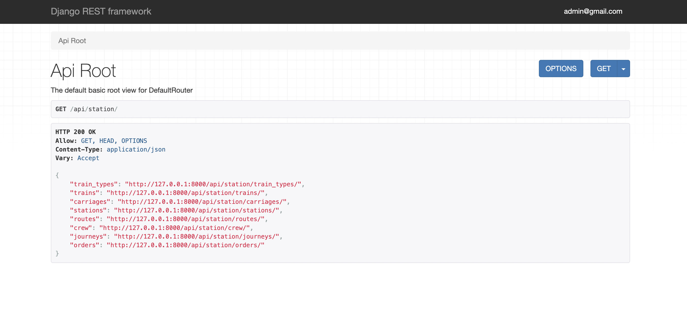

# Train Station Management API

> An effective train transportation management system: This API service is purpose-built with Django Rest Framework (
> DRF) to handle key aspects of railway operation. It includes the management of train types, carriages, stations,
> routes,
> crews, journeys, and ticket orders.

# How to Use

## Docker Hub Installation

Get application image directly from Docker Hub:

[Train Station API on the Docker Hub](https://hub.docker.com/r/oliuby/train-station/)

```shell
#Use the following command to pull the image:
docker pull oliuby/train-station
```

## Installation from GitHub

```shell
# Clone the repository
git clone https://github.com/olenaliuby/train-station

# Create a virtual environment and activate it
python -m venv venv
source venv/bin/activate

# Install necessary packages
pip install -r requirements.txt

# Set up environmental variables for Postgres and your secret key
export POSTGRES_HOST=<your db hostname>
export POSTGRES_DB=<your db name>
export POSTGRES_USER=<your db username>
export POSTGRES_PASSWORD=<your db user password>
export SECRET_KEY=<your secret key>

# Apply migrations and start the server
python manage.py migrate
python manage.py runserver
```

## Execution with Docker

To build and run the application with Docker, use the following commands:

```shell
docker-compose build
docker-compose up
```

These commands will build and start all the services defined in docker-compose.yml file, respectively.

## Key Features

* Train Management: Comprehensive handling of different train types and their corresponding carriages.
* Route and Station Management: Ability to configure various routes with associated stations.
* Crew and Journey Management: Facilitate the management of crew assignments and journey schedules that combine
  designated routes and trains.
* Image Upload: Allow users to upload images for trains, crew members, and journey schedules.
* Ticket Management: Manage ticket orders with detailed journey specifics, seat numbers, and departure dates.
* User Management: Provide user authentication and authorization for the API endpoints.
* API Documentation: Provide detailed documentation of the API endpoints with Swagger.

## API Endpoints

Below is a snapshot of the API endpoints available:


